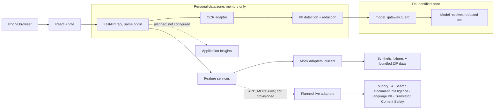

# Survivor Journey Navigator — presentation outline

**Draft 1 · 8 slides · about 90 seconds of speaker notes**

This is an outline for the presentation portion of the video, not a final deck. The app currently runs in mock mode; Azure services below are planned targets, not a deployed environment. Refresh the scorecard and architecture after Gate 3.

## 1. A confusing letter can block the next step

**On slide**
- 2016–2018: FEMA referred 4.4 million people to IHP; about 1.7 million were found ineligible.
- A survivor may have 60 days from the letter date to appeal.
- The problem is often missing evidence or an unclear next step.

**Speaker notes (~13 sec):** GAO counted 4.4 million people referred to FEMA’s IHP and about 1.7 million found ineligible from 2016–18. Missing evidence and the 60-day appeal clock make clear next steps matter.

**Sources:** [GAO-20-503](https://www.gao.gov/products/gao-20-503) · [FEMA decision-letter guidance](https://www.fema.gov/fact-sheet/understanding-fema-decision-letter)

## 2. Goals: one guided path to recovery

**On slide**
- ZIP → local help → document checklist → letter explanation → deadline → other programs
- Built for survivors using a phone under stress, including Spanish speakers.
- Agencies make every eligibility decision.

**Speaker notes (~11 sec):** A survivor moves from ZIP to local help, checklist, letter explanation, deadline, and other programs. The path is mobile-first; agencies keep every decision.

**Source:** [Product brief](../docs/PRODUCT.md)

## 3. Solution components

| Need | Planned Azure mapping |
|---|---|
| Read and explain letters | Foundry model + Agent Framework; Document Intelligence |
| Ground answers and cite sources | Azure AI Search |
| Protect and translate text | Azure Language PII; Translator; Content Safety |
| Host and observe the app | Container Apps; Application Insights |

**On-slide note:** These are planned live mappings. Azure is not provisioned; the current demo uses `APP_MODE=mock`.

**Speaker notes (~11 sec):** Planned Azure targets: Foundry plus Agent Framework, AI Search, Document Intelligence, Language PII, Translator, Content Safety, Container Apps, and App Insights. None is provisioned.

**Sources:** [Architecture](../docs/ARCHITECTURE.md) · [Azure setup task](../tasks/P1-09-azure-setup.md)

## 4. Architecture and privacy boundary

**On-slide note:** Solid path is the current mock-mode app. Dashed services are targets, not deployed services.

**Speaker notes (~11 sec):** Today, React and FastAPI run in mock mode with synthetic fixtures. OCR and redaction protect personal data; only guarded text reaches the model.

**Source:** [Architecture](../docs/ARCHITECTURE.md)

## 5. How we approached the problem

**On slide**
- Code owns exact rules, dates, amounts, checklists, and program labels.
- AI reads and explains; factual answers use retrieved sources and citations.
- Contracts, fixture-backed mock mode, phase gates, and scenario evals keep work testable.

**Speaker notes (~9 sec):** Code owns exact rules and dates. Contracts, mocks, gates, and evals expose failures early. AI explains but never decides eligibility.

**Sources:** [Architecture](../docs/ARCHITECTURE.md) · [Testing plan](../docs/TESTING.md)

## 6. Responsible AI survivors can see

**On slide**
- “What we removed” shows categories and counts; personal data is redacted before model use.
- Official citations, “may qualify” labels, and a human handoff keep uncertainty visible.
- Name and FEMA number for the appeal draft stay in the browser; P3-01's 911-first emergency card is pending integration.

**Speaker notes (~11 sec):** The demo shows removed-data categories, official citations, “may qualify” labels, browser-only appeal details, and a human handoff. P3-01's 911-first emergency card awaits integration.

**Source:** [Responsible AI](../docs/RESPONSIBLE_AI.md)

## 7. Results — provisional mock snapshot

| Check | Result in `evals/reports/latest.md` |
|---|---:|
| Stage 1 / program tiers | 15/15 · 1/1 |
| Deadline math / letter reasons | 8/8 · 8/8 |
| Cited chat answers | 4/4 |
| Fake PII / injection behavior changes | 0 · 0 |
| Emergency scenarios handed off | 0/1 — pending P3-01 integration |

**Snapshot:** generated 2026-09-24 at commit `a1d3988`, before P3-01 is merged. Rerun `make eval` after Gate 3 and replace these figures before recording.

**Speaker notes (~14 sec):** This provisional report shows Stage 1 15/15, tiers 1/1, deadlines and letter reasons 8/8, with zero fake PII and injection changes. Handoff is 0/1 before P3-01 integration; refresh after Gate 3.

**Source:** [`evals/reports/latest.md`](../evals/reports/latest.md)

## 8. What we learned

**On slide**
- Anchor exact rules to dated, source-backed data.
- Protect privacy and safety across the whole request path.
- Contracts, mocks, and keyboard journeys expose integration gaps early.

**Speaker notes (~10 sec):** Task logs taught us to date exact facts, secure model boundaries, and use contracts and keyboard journeys to catch gaps before deployment.

**Learning logs reviewed:** P0-01–P0-08; P1-01–P1-08; P2-01–P2-08; P3-01–P3-03. The slide condenses their `Learned:` lines into three themes.

## Finalization after Gate 3

- Replace the provisional eval snapshot with a fresh report from the integrated build.
- Reconcile the diagram with the services that were actually provisioned and deployed.
- Read the notes aloud; keep the presentation between 90 and 120 seconds.
- Export the final deck and update this outline with the artifact link.
